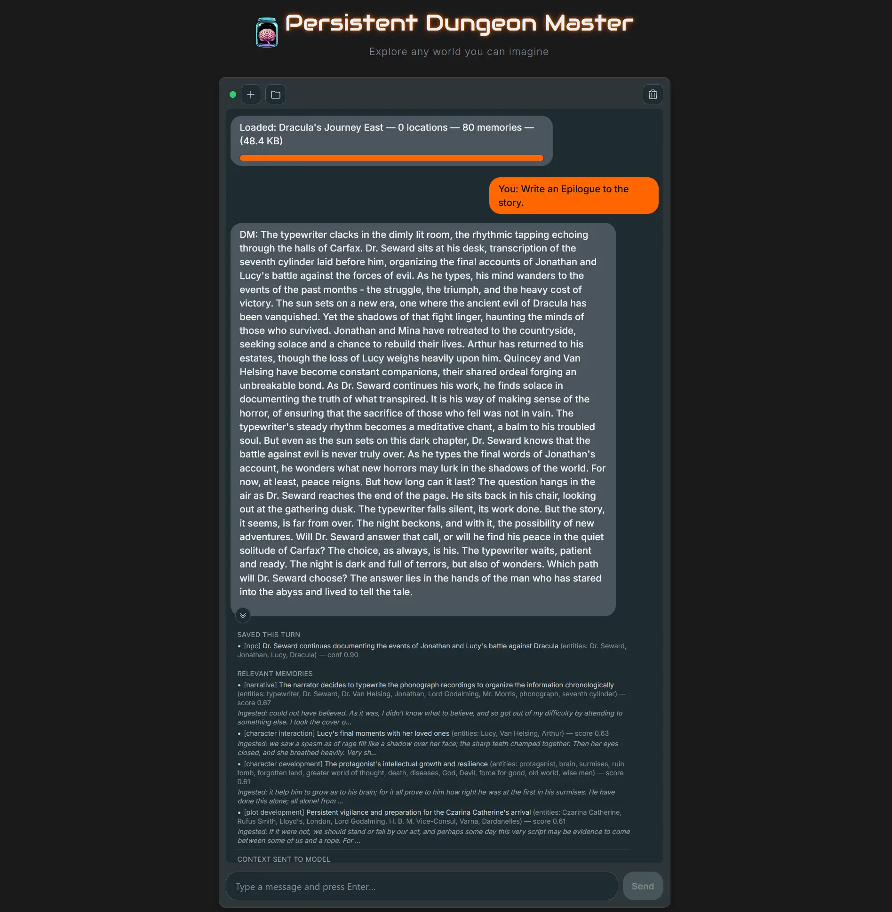

#  PersistentDM

PersistentDM is a text-based adventure roleplay system that uses an AI "Dungeon Master" to create an interactive story. Unlike simple chatbots, it remembers what happens in the world and uses that knowledge to generate its responses.

It also supports "ingest shards," which let you load pre-built world knowledge (like locations and memories) to start a new game in an established setting.

Key Features

    Persistent Memory: The AI remembers key facts, events, and characters from your story using a vector database.

    World-Aware Replies: The AI checks its memory for relevant facts and NPC details before responding, making the story more consistent.

    Automatic Memory: The system automatically saves important new facts after each turn.

    Spatial Awareness: A built-in location graph helps the AI (and you) keep track of where you are and where you can go.

    Reusable Worlds: You can save and load "shards" of world data (locations, memories) to reuse across different game sessions.

Tech Stack

    Backend: FastAPI (Python)

    Frontend: React (with Vite) and Tailwind CSS

    LLM: Runs a local model (Harbinger-24B-GGUF) using llama-cpp-python.

Development Setup

1. Prerequisites

    Python 3.11+

    Node.js 18+

    NVIDIA GPU with 24GB+ VRAM. This is essential for running the 24B parameter model.

    CUDA Toolkit (required for the GPU to work)

2. Steps

    Python

    `python3 -m venv .venv`

    `source .venv/bin/activate`
    `pip install -r requirements.txt`

    Frontend:
    Bash

    `cd frontend && npm install`

3. Model & CUDA

    Build with CUDA: The Python LLM library must be built from source to use your GPU.
    Bash

    `CMAKE_ARGS="-DGGML_CUDA=on"`
    `pip install --no-binary=:all: --no-cache-dir llama-cpp-python==0.3.16`

4. Model installations

    This is currently configurable in llama.py.
    MODEL_PATH = "~/dev/llm/Harbinger-24B-Q5_K_M.gguf"

5. Run the script

   `./scripts/run.sh`

6. Connect via http://localhost:5174/
